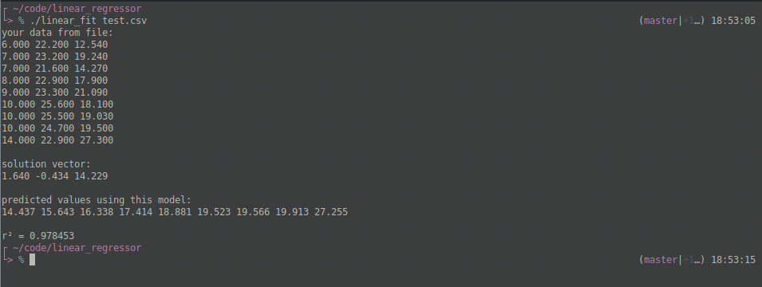
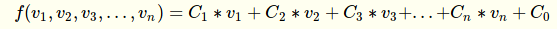
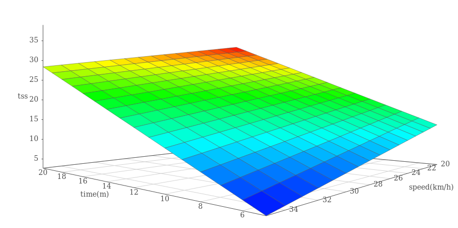

# Linear regressor

Reads data from csv file and performs a linear regression on it if possible.

## How to compile
type `make`

## Usage
`./linear_fit <csv file>`

## Example

## csv file format
every number will end with a comma. Each line except the last will end with a newline. See test.csv for an example.

## What use is this?
If you have data that you need to fit a linear model to, then this should do it.

## How do I interpret the output?
The solution is a linear function of the form:

where the v's are your variables and the C's are the constants that give you your solution.

Here's a 3D plot of the above function:

## It didn't work when I tried it.
I mean, what do you want from me?

I haven't stress-tested this at all. It'll probably fail with large numbers and/or large data sets. It works pretty well for me.

## TO-DO
* I'll include polynomial regression later.
* make a smarter makefile later.
